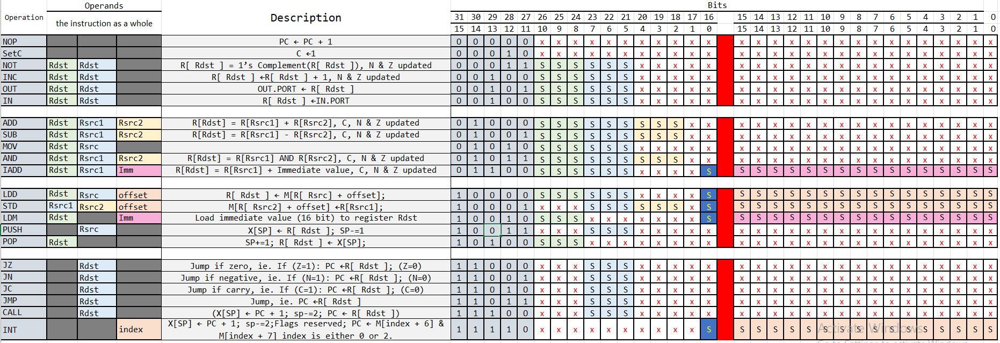

<h1 align="center">
  ar-kak-tecture
</h1>
<p align="center">
  <a style="text-decoration:none" >
    
  </a>
  <a style="text-decoration:none" >
    
  </a>
  <a style="text-decoration:none" >
    
  </a>
</p>

# Overview

This a simple 5-stage pipelined processor implementation in VHDL, based on **Harvard architecture** (Program and data memories are separated). This also includes a simple parser (written in python) to convert assembly code into a binary memory file.

The processor has a RISC-like instruction set architecture, with 8 word-sized general purpose registers: `R0 - R7` and some special purpose registers: `program counter (PC) And stack pointer (SP)` The initial value of SP is (2^20-1). The memory address space is 1 MB of 16-bit width and is word addressable. ( N.B. word = 2 bytes). The data bus is 32 bits.

# Setup

### 1- Clone this repository with

```bash
git clone https://github.com/We2Am-BaSsem/ar-kak-tecture.git
```

### 2- Create new project with Modelsim in the same directory with ProjectName "ar-kak-tecture" to create the work folder and mpf file.

```bash
ar-kak-tecture
```

### 3- Then add existing files to add vhd files to your local project
unfortunately, You need to do this countinousley when you pull from the remote repository

### 4- You can add your assembly code to "Code Exampls" directory and then replace the file_name variable in the Parser, python script, in "Compiler" Directory with your file name and run the script.

### 5- The previous step will generate mem file conatins instruction memory of your code in the "Memory files".
  


# Design

The Table below shows supported operations, their operands and how they are fetched.

<br/>

### Fetch Stage:

Fetch stage Start initializing the the exceptions, interrupts and code addresses from the instruction memory and store the address of the code in the PC register and keep adding 2 bytes on the PC register every clock cycle if the instruction does not require offset otherwise we add 4 bytes to skip the next 16 bits, used as offset.

### Decode Stage:

The decode stage consists of two main parts, the **register file** and the **control unit**.

##### Register file:

Consists of 8 16-bit general purpose registers. The register file takes the slice [10:2] of the instruction as input, and determines:

• readAddress1, readAddress2, which are the locations from which data should be fetched

• writeAddress, the register the data should be written to, if any

• writeData, the data to be written in the register, if any

The register file outputs readData1 and readData2, which are the data to be processed

##### Control unit:

the control unit is responsible for firing several control signals according to the input instruction It takes as input slice [15:11] of an instruction and outputs control signals including:

• MemWrite: a signal to determine if the memory will write back to the register file

• MemRead: a signal to determine if data will be written to the memory

• RegWrite: a signal to determine if data will be written to the register file

• MemtoReg: a signal to determine whether data to the register should come from the memory or the ALU

### Excution Stage:

##### ALU:

The ALU Part is responsible for 2-Operand Operations, 1-Operand Arithmatic Operations (INC, NOT) and for Load & Store address calculations.There are mainly 4 parts in this Design:

1. **ALU Control**: Uses opcode as an input and outputs **ALU control signals** which determine how the ALU works.

2. **ALU Compute**: Uses ALU control signals & Read Data as input and uses Read Data from Decoding to produce **ALU output**.

3. **ALU to Flags**: Determines how the current ALU computation affects flags & if it should.

4. **Full Forwarding Unit**: Uses Stored "Rsrc & Rdst"s in buffers to forward data from Memory stage or Execution Stage to current Execution in the event of any **Data Hazards**.

##### Branching:

Alongside exception handling, interrupts, and function calls, four main branching intsructions are implemented
The branching unit takes as input slice [13:11] of the instruction, and serveral destinations from which one should be selected as the next program counter:
the normal program counter progression
the exception handler addresses
the destination for jump intsructions
the carry, negative, and zero flags

A decoder followed by AND gates checks the type of jump instruction and the value of its corresponding flag,
the output of this unit is a signal determining if a jump instruction is valid and should be executed next.
This control signal is a selector to a multiplexer which is the first of 3 mltiplexers

The output of the first mux selects one of two options, the normal program counter progression, or the destination specified by the the jump instruction
the nature of this jump instruction has already been taken care of through the decoder explained previously

The second mux has a a selector determining if an exception occured, and hence outputs either the exception handler address, or the output of the previous mux

The third mux is responsible for function calls and interrupts, its selector checks if the instruction to be done is either a jump related to calls or interrupts, specifically a return or rti which jumps back after a function call or interrupt is finished.
It then decides whether the next outupt is the output of the second mux, or the address of the instruction to be executed after a function or interrupt are done

### Memory & WriteBack Stages:

##### Memory:

The memory stage consists of 2 components, the data memory and the SP register which its enable is pop or push signal.

At the SP register before setting the new value it verify if it is a valid data or not. It it is not valid then the exception signal is raised.

The memory module works only if the stack exception signal is low otherwise it works according to the value of pop, push and control signal as below:

```
popsignal     pushpsignal     controlsignal
    1             0               1             => Memory Output = Memory[SP] & Memory[SP - 1]
    1             0               0             => Memory Output = Memory[SP]
    0             1               1             => Memory[SP] & Memory[SP - 1] = PC
    0             1               0             => Memory[SP] = Memory Input
```

If both the push and pop signals are low then it is memory-register operation so according to the re and we it writes to the memory or read from the memory respectively.

##### Writeback:

In write back stage according to the MemtoReg signal it whether writes data from ALU output if the signal is low or writes data from memory if the signal is high.

It also pass back the according regWrite signal and writeAddress of the instruction to the register file to avoid data hazard.

# Schema


