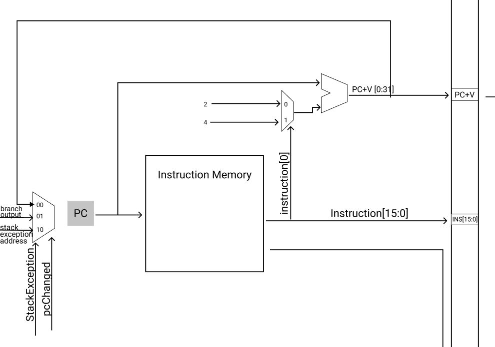
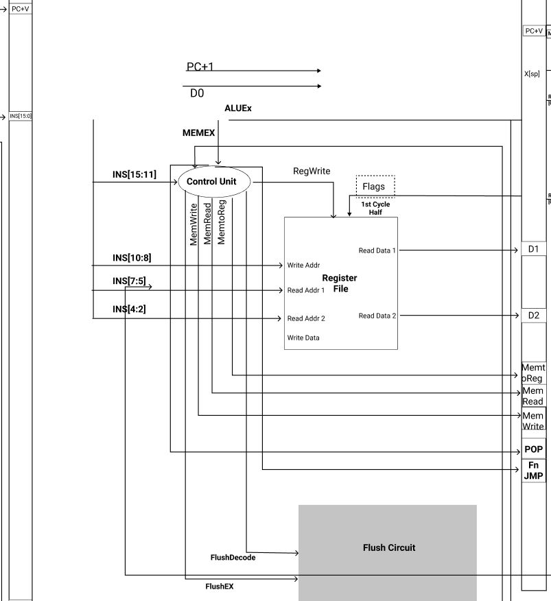
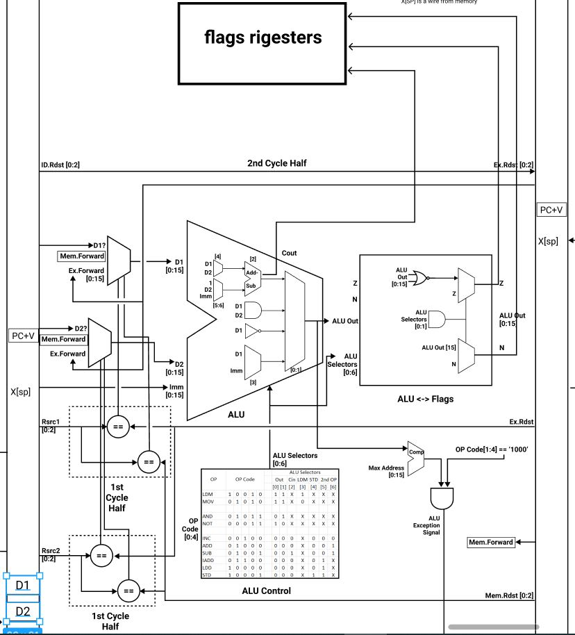
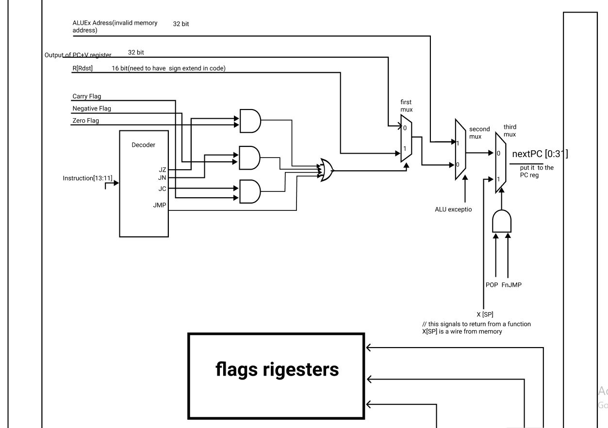
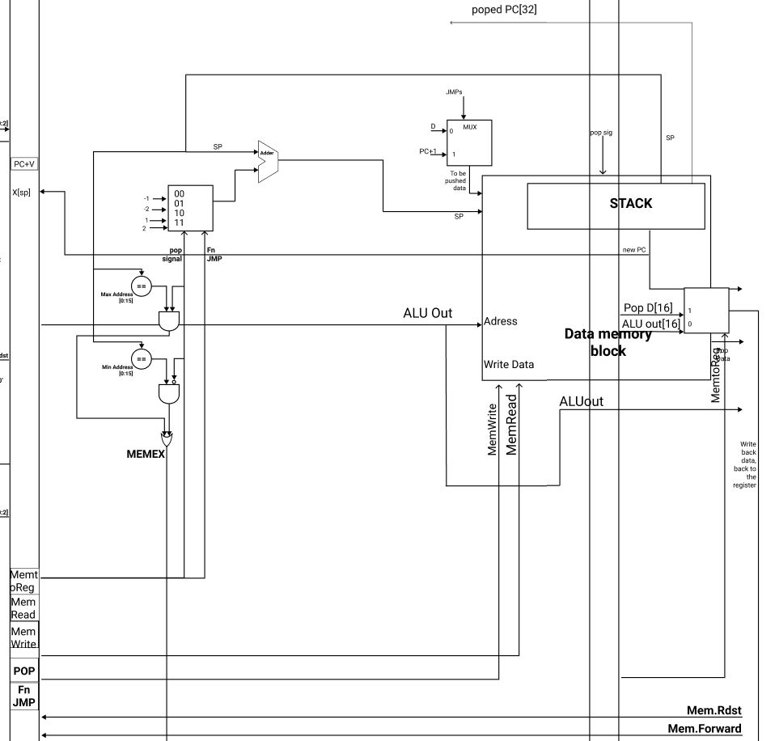

<h1 align="center">
  ar-kak-tecture
</h1>

# Overview

This a simple 5-stage pipelined processor implementation in VHDL, based on **Harvard architecture** (Program and data memories are separated). This also includes a simple parser (written in python) to convert assembly code into a binary memory file.

The processor has a RISC-like instruction set architecture, with 8 word-sized general purpose registers: `R0 - R7` and some special purpose registers: `program counter (PC) And stack pointer (SP)` The initial value of SP is (2^20-1). The memory address space is 1 MB of 16-bit width and is word addressable. ( N.B. word = 2 bytes). The data bus is 32 bits.

# Design


<br/>

The Table below shows supported operations, their operands and how they are fetched.

<br/>

### Fetch Stage:


<br/>
Fetch stage Start initializing the the exceptions, interrupts and code addresses from the instruction memory and store the address of the code in the PC register and keep adding 2 bytes on the PC register every clock cycle if the instruction does not require offset otherwise we add 4 bytes to skip the next 16 bits, used as offset.

### Decode Stage:


<br/>
The decode stage consists of two main parts, the **register file** and the **control unit**.

##### Register file:

Consists of 8 16-bit general purpose registers. The register file takes the slice [10:2] of the instruction as input, and determines:

• readAddress1, readAddress2, which are the locations from which data should be fetched

• writeAddress, the register the data should be written to, if any

• writeData, the data to be written in the register, if any

The register file outputs readData1 and readData2, which are the data to be processed

##### Control unit:

the control unit is responsible for firing several control signals according to the input instruction It takes as input slice [15:11] of an instruction and outputs control signals including:

• MemWrite: a signal to determine if the memory will write back to the register file

• MemRead: a signal to determine if data will be written to the memory

• RegWrite: a signal to determine if data will be written to the register file

• MemtoReg: a signal to determine whether data to the register should come from the memory or the ALU

### Excution Stage:

##### ALU:


<br/>
This a simple 5-stage pipelined processor implementation in VHDL, based on **Harvard architecture** (Program and data memories are separated). This also includes a simple parser (written in python) to convert assembly code into a binary memory file.

##### Branching:


<br/>
This a simple 5-stage pipelined processor implementation in VHDL, based on **Harvard architecture** (Program and data memories are separated). This also includes a simple parser (written in python) to convert assembly code into a binary memory file.

### Memory & WriteBack Stages:


<br/>

##### Memory:

The memory stage consists of 2 components, the data memory and the SP register which its enable is pop or push signal.

At the SP register before setting the new value it verify if it is a valid data or not. It it is not valid then the exception signal is raised.

The memory module works only if the stack exception signal is low otherwise it works according to the value of pop, push and control signal as below:

```
popsignal     pushpsignal     controlsignal
    1             0               1             => Memory Output = Memory[SP] & Memory[SP - 1]
    1             0               0             => Memory Output = Memory[SP]
    0             1               1             => Memory[SP] & Memory[SP - 1] = PC
    0             1               0             => Memory[SP] = Memory Input
```

If both the push and pop signals are low then it is memory-register operation so according to the re and we it writes to the memory or read from the memory respectively.

##### Writeback:

In write back stage according to the MemtoReg signal it whether writes data from ALU output if the signal is low or writes data from memory if the signal is high.

It also pass back the according regWrite signal and writeAddress of the instruction to the register file to avoid data hazard.

# Setup

> ## clone this repository with

```bash
git clone https://github.com/We2Am-BaSsem/ar-kak-tecture.git
```

> ## create new project with Modelsim in the same directory with ProjectName "ar-kak-tecture" to create the work folder and mpf file.

```bash
ar-kak-tecture
```

> ## Then add existing files to add vhd files to your local project
>
> #### unfortunately, You need to do this countinousley when you pull from the remote repository
